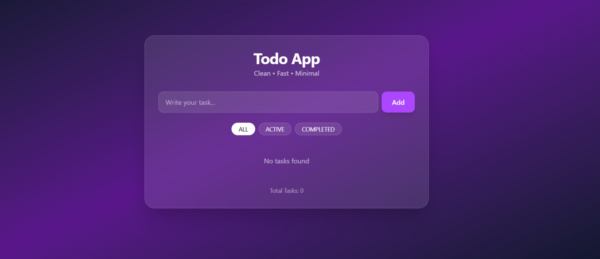
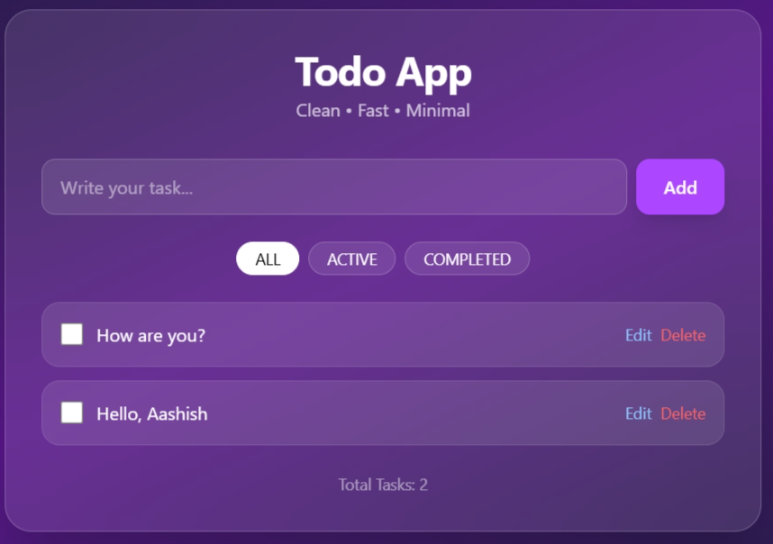
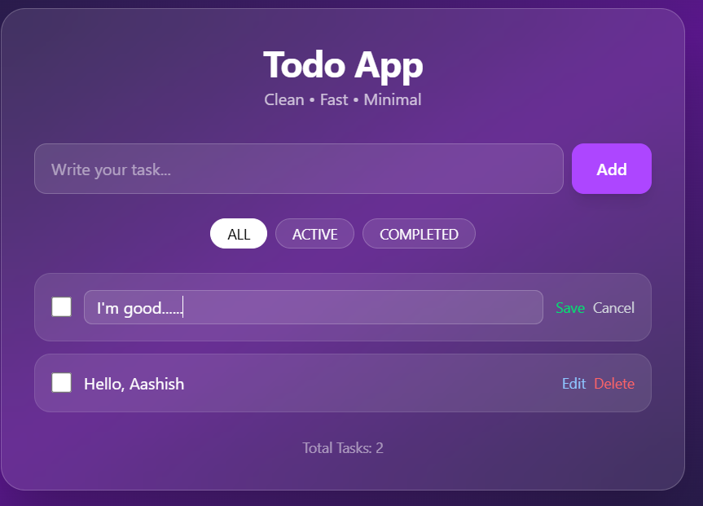

# 📝 React Todo App

A clean and responsive Todo application built with **React** and **Tailwind CSS**. This project demonstrates fundamental React concepts such as state management, conditional rendering, event handling, and list manipulation while providing a modern user experience.

---

## 🚀 Features

- ✅ Add new tasks
- ✏️ Edit existing tasks
- 🗑️ Delete tasks
- ☑️ Mark tasks as completed or active
- 🔍 Filter tasks (All, Active, Completed)
- 💾 Persist data using Local Storage
- ⌨️ Keyboard support (Enter to add/save, Escape to cancel editing)
- 📱 Responsive design for mobile and desktop
- 🎨 Modern UI built with Tailwind CSS

---

## 📸 Screenshots 



### Add Interface



### Edit Task




## 🛠️ Built With

- **React** – Frontend library for building user interfaces
- **Tailwind CSS** – Utility-first CSS framework
- **JavaScript (ES6+)** – Application logic
- **Vite** – Fast development environment and build tool

---

## 📂 Project Structure

```text
react-todo-app/
├── public/
├── src/
│   ├── components/
│   │   └── TodoApp.jsx
│   ├── App.jsx
│   ├── main.jsx
│   └── index.css
├── screenshots/
├── package.json
├── vite.config.js
└── README.md
```

---

## ⚙️ Installation

### 1. Clone the repository

```bash
git clone https://github.com/AashishhChau/react-To-Do-App
```

### 2. Navigate to the project folder

```bash
cd reactToDoAapp
```

### 3. Install dependencies

```bash
npm install
```

### 4. Start the development server

```bash
npm run dev
```

### 5. Open in your browser

```text
http://localhost:5173/
```

---

## 📖 Learning Outcomes

This project helped reinforce the following React concepts:

- Functional Components
- JSX Syntax
- `useState` Hook
- `useEffect` Hook
- Event Handling
- Conditional Rendering
- List Rendering with `.map()`
- Array Methods (`map`, `filter`)
- Local Storage Integration
- Tailwind CSS Styling

---

## 🎯 Future Improvements

- [ ] Drag and drop task reordering
- [ ] Task priority levels
- [ ] Due dates and reminders
- [ ] Dark/Light mode toggle
- [ ] User authentication
- [ ] Backend integration with Node.js and MySQL/Firebase
- [ ] Task categories and labels

---

## 📌 Author

**Aashish Chaudhary**

- GitHub: https://github.com/AashishhChau/

---

## ⭐ Show Your Support

If you found this project helpful, consider giving it a **star** on GitHub. It helps others discover the project and motivates further improvements.

---

## 📜 License

This project is licensed under the **MIT License**.

Feel free to use and modify it for personal or educational purposes.